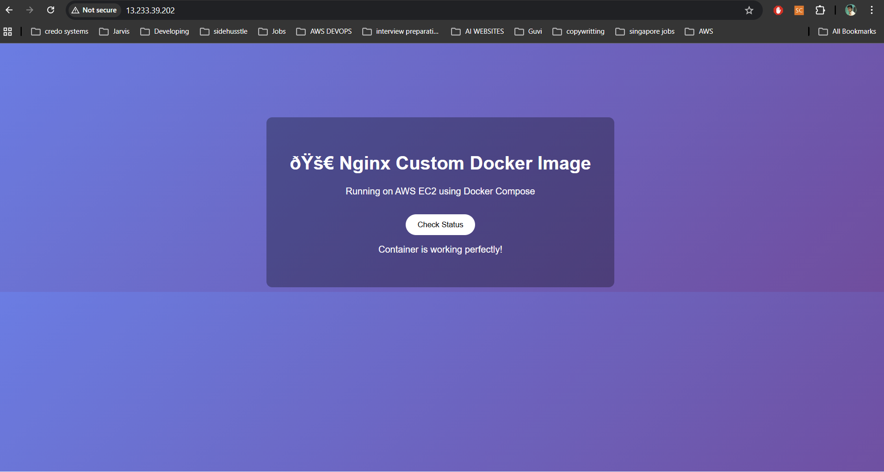

# 🚀 Custom Nginx Deployment using Docker Compose


## 📌 Project Overview

This project demonstrates how to deploy a **custom Nginx container** using Docker Compose on an AWS EC2 instance.  
A bind mount is used to serve website content from the host machine into the container.

---

## 🛠 Technologies Used

- AWS EC2
- Docker
- Docker Compose
- Nginx
- GitHub

## 🏗 Architecture

AWS EC2
│
Docker Engine
│
Docker Compose
│
Custom Nginx Container
│
Bind Mount (/var/opt/nginx)
│
Static Website

## Project Features
- Custom Nginx Docker image
- Docker Compose deployment
- Bind mount at `/var/opt/nginx`
- Image pushed to Docker Hub

## Run the Project

```bash
docker compose up -d --build

# Docker Compose Nginx Deployment



| Markdown Element | Needed Symbol |
|---|---|
| Heading | `#` |
| Bullet list | `-` |
| Code block | ``` |
| Folder structure | ``` |
